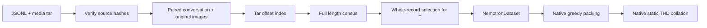

# Nemotron Image v3 for MDP training

This package supplies complete Nemotron image conversations to Qwen3.5-VL through
`--dataset-provider nemotron`. It includes verified conversion, full length
assessment, budget-specific selection and a SEC/mock convergence example. No
external toolkit checkout or custom training wrapper is required.

The branch is based on `BestJuly/dev_mdp` at
`e10d8b7a234d423cb7a82b3ec2b6f81974a96871`, which includes the merged
[PR48](https://github.com/BestJuly/Megatron-LM/pull/48) and
[PR57](https://github.com/BestJuly/Megatron-LM/pull/57). Its base tree matches the
original experiment's PR48 + PR57 integration at
`cc72ee2b5623ac65fc4aa92e5268c0408c53c486`. Their packing, padding, model and
encoder memory-control implementations are unchanged.

## Data flow

[Nemotron-Image-Training-v3](https://huggingface.co/datasets/nvidia/Nemotron-Image-Training-v3)
stores JSONL conversations and separate media archives. Each record can contain
multiple user/assistant turns and ordered image references. SEC uses rendered
financial-document pages; CLEVR uses synthetic visual scenes. Both follow the
same preparation and loading contract.



| Component | Responsibility |
|---|---|
| Adapted Bridge converter | Join conversations and media; preserve original image bytes; deterministic 95/5 train/validation split |
| Energon preparation helper | Produce offline `.nv-meta` indexes and Bridge-compatible dataset metadata |
| `NemotronDataset` | Read paired tar offsets, run the pinned Qwen processor, shift labels and mask non-assistant/special targets |
| Native sampler | Data-parallel partitioning and cyclic ordering |
| PR48 greedy packing | Group complete records within the decoder token budget and real-sequence cap |
| PR48 static THD collation | Pad decoder capacity and metadata to the configured static layout |

Training does not instantiate an Energon dataloader or use its runtime packing,
shuffle or recovery. Selection decides which whole records are eligible; packing
then groups eligible records.

For an illustrative budget `T=10`, lengths `A=6, B=3, C=11, D=4` admit `A, B, D`
and exclude all of `C`. A greedy pack can hold `A+B=9`, followed by a padding
row; `D` starts another pack. No piece of `C` is truncated into either pack.
The same admission check runs when all source records fit.

## Pins and dependencies

- Dataset revision: `7656391d4d4cb11ec3722b34f10d499435de0460`.
- Processor: `Qwen/Qwen3.5-35B-A3B` at
  `59d61f3ce65a6d9863b86d2e96597125219dc754`, `min_pixels=4096`,
  `max_pixels=262144`, vocabulary 248320 and image token ID 248056.
- Use PyTorch, Pillow, Hugging Face Hub and a Qwen3.5-compatible Transformers
  installation. Cache the pinned processor in `HF_HOME` before offline jobs.
- Preparation creates a temporary venv inheriting the container's PyTorch and
  installs `webdataset==1.0.2`, `megatron-energon==7.4.0` and
  `fsspec==2026.2.0`. The fsspec pin preserves compatibility with the source
  experiment's datasets 4.8.4. `--inside-venv` uses caller-installed dependencies;
  all data checks still run.
- Training additionally needs this branch's Transformer Engine, fused attention,
  GDN/FLA and MoE dependencies. The recipe uses TE cross entropy and disables
  gradient accumulation fusion, matching its source experiment.

The paired `.jpgs` field is a trusted pickle list of original image bytes, which
may be PNG. Only consume trusted converter output. Keep converted archives and
indexes immutable during training.

## Download and prepare

Run from the Megatron-LM root. Authentication uses the normal Hugging Face login
cache or `HF_TOKEN`; the package does not load `.env`.

```bash
python -m examples.multimodal_dev.data.nemotron.download \
  --output-dir /data/nemotron-image-v3/source

python -m examples.multimodal_dev.data.nemotron.prepare_training \
  --data-root /data/nemotron-image-v3 \
  --subset long_document_sec_2 --token-budget 32768

python -m examples.multimodal_dev.data.nemotron.prepare_training \
  --data-root /data/nemotron-image-v3 \
  --subset clevr_2 --token-budget 32768
```

`download` retrieves the **full HF repository snapshot**, with Turing and SEC
1/2/4 as intermediate phases. Plan storage accordingly. It does not fetch
external image collections referenced by some other subsets. Preparation
converts only the requested self-contained subset. Existing downloads and
converted tars can be reused with `--prepared-dir`; source hashes and conversion
provenance are rechecked.

The prepared directory contains shards, `.nv-meta`, `manifest.json`,
`mdp-training-index.json`, a full census under `mdp-assessment/`, and
`mdp-selection-{subset}-{budget}.json` with `.validation.json` and
`.preparation.json` audit companions.

The census tokenizes every conversation. It derives visual token counts from
actual processor grids at each distinct image resolution, then checks full
pixel/token equivalence on deterministic samples. Selection additionally
validates the longest admitted records in each split through `NemotronDataset`.
This is not full pixel decoding of every image during preparation.

Over-budget records are excluded whole. A subset with zero exclusions still
needs a selection JSON. Training rejects bare tar directories, changed budgets
or processor settings, duplicate keys and cross-split keys. Repeating preparation
validates an identical selection without rewriting it; a conflicting selection
is rejected. Weighted subset mixing and exact greedy-loader resume are not
implemented by this adapter.

## PR57 A17B-light SEC/mock comparison

`convergence_32k.json` preserves the shared controls of the completed source
experiment: random initialization, eight decoder layers, hidden size 4096,
32 experts/top-10, eight vision layers and MTP1. Its topology is one four-GPU
node, TP1/PP2/EP2/CP1 (DP2), MBS1/GBS8, 32K decoder budget, static K64,
greedy packing, BF16 and 500 optimizer iterations.

Both arms use 8192-row encoder chunks plus whole-encoder replay. Chunking respects
complete vision-item boundaries; whole replay limits retained encoder graphs.
These existing MDP controls preserve admitted records. The source experiment ran
on four GB200 GPUs per arm. This portable package has CPU regression coverage;
its new entrypoint has not had a separate GPU rerun.

Run one arm at a time on the allocated node, with a fresh output directory each
time. W&B uses the configured login or `WANDB_API_KEY` and logs to project
`nemotron-image-dataset`; optionally pass `--wandb-entity`.

```bash
python -m examples.multimodal_dev.data.nemotron.run_convergence \
  --dataset nemotron \
  --selection /data/nemotron-image-v3/energon-long_document_sec_2/mdp-selection-long_document_sec_2-32768.json \
  --run-name sec2-32k --output-dir /results/sec2-32k --dry-run

python -m examples.multimodal_dev.data.nemotron.run_convergence \
  --dataset mdp_mock \
  --run-name mock-32k --output-dir /results/mock-32k --dry-run
```

Remove `--dry-run` to execute. First use `--iterations 5` and distinct smoke-run
names/directories to check the container before full runs. A smoke changes the
iteration limit while preserving the 500-step learning-rate schedule.
Assistant-only real targets and synthetic mock targets are different objectives;
their absolute losses do not rank datasets.

`report_convergence.py` reads full W&B histories and exports plots locally:

```bash
python -m examples.multimodal_dev.data.nemotron.report_convergence \
  --real-run ENTITY/nemotron-image-dataset/REAL_ID \
  --mock-run ENTITY/nemotron-image-dataset/MOCK_ID \
  --real-label 'SEC 2' --model-label 'PR57 A17B light' \
  --expect-iterations 500 --output-dir /results/comparison
```

It rejects missing/duplicate iterations, nonfinite loss or norms, and unchanged
parameter norms. Mock has an additional test split; the native logger reuses
the validation key for its final test, which the plot marks separately. W&B and
Matplotlib are needed only for reporting. `probe_pr48.py` separately checks
greedy packing and CUDA collation without model forward/backward.

## Tests and attribution

```bash
python -m pytest -q examples/multimodal_dev/data/nemotron/tests
```

These CPU tests use PyTorch, Pillow, webdataset and pytest. They live beside the
standalone package to avoid inheriting the training suite's GPU/Megatron
initialization fixtures. They cover source corruption, paired offsets, label
masking, provenance/budget rejection, whole-record selection, stable publication,
complete histories and matched experiment controls. See [DESIGN.md](DESIGN.md).

`prepare_nemotron_image_v3.py` and `prepare_webdataset.py` are adapted from
[Megatron-Bridge at 4386117130f9e86024fc694e77ccc9c903899b9d](https://github.com/NVIDIA-NeMo/Megatron-Bridge/tree/4386117130f9e86024fc694e77ccc9c903899b9d):
`tutorials/data/energon/prepare_nemotron_image_v3.py` and
`src/megatron/bridge/data/energon/prepare.py`. Their Apache-2.0 notices are retained.
